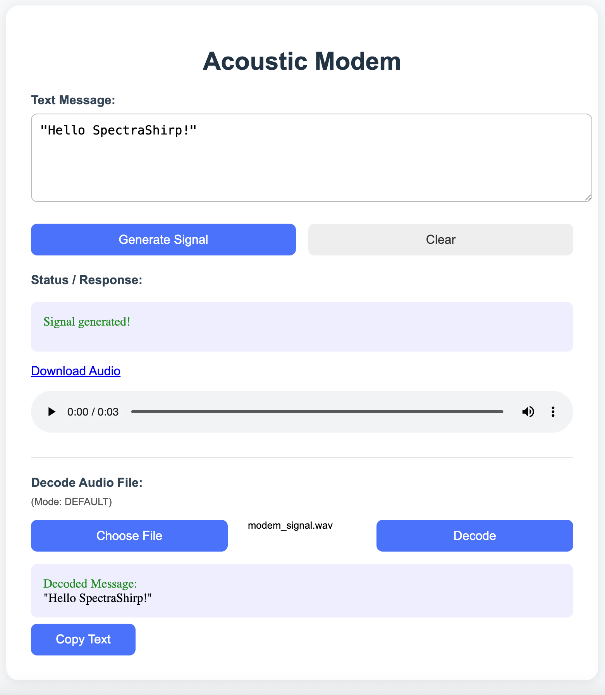
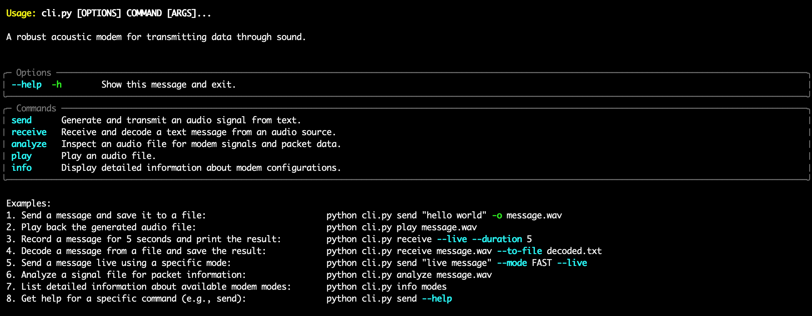

# SpectraChirp Acoustic Modem

[](https://spectra-chirp.vercel.app)
[](https://opensource.org/licenses/MIT)
[](https://www.python.org/)
[](https://github.com/psf/black)

SpectraChirp is a Python-based acoustic modem that transmits data through sound waves using Multiple Frequency-Shift Keying (MFSK). **It stands out with its robust error correction (Reed-Solomon), automatic mode detection, reliable synchronization via chirp signals, and the use of Walsh-Hadamard spreading for enhanced signal robustness, ensuring dependable communication even in challenging acoustic environments.** It features a simple web interface and a command-line interface for generating and decoding audio signals, allowing text to be sent from one computer to another using only a microphone and speakers.

---

## Table of Contents

- [Features](#features)
- [How It Works](#how-it-works)
- [Setup and Usage](#setup-and-usage)
- [Project Structure](#project-structure)
- [Getting Help](#getting-help)
- [Contributing](#contributing)
- [Future Improvements](#future-improvements)
- [License](#license)

---

## Features

- **Text-to-Audio Encoding**: Convert any text message into a `.wav` audio file.
- **Audio-to-Text Decoding**: Decode the audio signal back into the original text.
- **MFSK Modulation**: Utilizes MFSK for data transmission.
- **Selectable Modes**:
    - **Default (Fast)**: Higher data rate for clear conditions.
    - **Robust**: Slower, but more resilient to noise.
- **Automatic Mode Detection**: The receiver automatically detects the sender's mode.
- **Error Correction**: Implements Reed-Solomon codes to correct errors caused by noise.
- **Synchronization**: Uses chirp signals to reliably synchronize the start of each data packet.
- **Web-Based UI**: Simple and intuitive frontend built with HTML and JavaScript.
- **Full Character Support**: Reliably transmits and decodes messages containing uppercase and lowercase letters, numbers, and special characters.

---

## How It Works

1.  **Packetization**: The input text is broken down into smaller chunks. Each chunk is placed into a packet containing a header (with packet sequence numbers) and a CRC checksum for integrity verification.
2.  **Forward Error Correction (FEC)**: Reed-Solomon codes are applied to each packet, adding redundant data that allows the receiver to detect and correct errors.
3.  **Modulation (MFSK)**: The binary data of the packet is converted into audio tones. This project uses Walsh-Hadamard spreading to make the signal more robust.
4.  **Synchronization**: A high-frequency "chirp" signal is prepended to each data packet. The receiver listens for this specific chirp to know when a new packet is starting.
5.  **Transmission**: The sequence of tones is saved as a `.wav` file, which can be played through speakers.
6.  **Demodulation & Decoding**: The receiver records the audio, finds the chirp signals, demodulates the tones back into binary data, uses the Reed-Solomon data to fix any errors, and reassembles the original text.

---

## Setup and Usage

### Prerequisites

- Python 3.8+
- `uv` (Python package installer). If you don't have it, install it with `pip install uv`.
-   **Audio Hardware**: A working microphone and speakers.

### Installation & Running

1.  **Clone the repository:**
    ```bash
    git clone https://github.com/saas-erp-hub/SpectraChirp.git
    cd SpectraChirp
    ```

2.  **Install Python dependencies:**
    ```bash
    uv pip install -r backend/requirements.txt
    ```

3.  **Start the backend server:**
    ```bash
    sh start_modem.sh
    ```
    You can check the server logs in `backend_startup.log`.

4.  **Open the Frontend:**
    Open the `frontend/index.html` file in your web browser or visit the [**Live Demo**](https://spectra-chirp.vercel.app).

### Web UI Usage



1.  **Sending**: Type your message, click **Generate Signal**, and play the resulting audio.
2.  **Receiving**: On another computer, record the audio as a `.wav` file. In the UI, click **Choose File**, select your recording, and click **Decode**.

<details open>
<summary><b>► Click to view Command Line (CLI) Usage</b></summary>

SpectraChirp also provides a command-line interface (`cli.py`) for scripting or advanced usage.



**Commands:**

-   **`send <text>`**: Generate and transmit an audio signal from text.
    -   `--from-file, -f <path>`: Read message from a text file.
    -   `--output, -o <path>`: Path to save the output WAV file (default: `modem_signal.wav`).
    -   `--mode, -m <mode>`: The MFSK modem mode to use. Available: `DEFAULT`, `FAST`, `ROBUST`.
    -   `--live, -l`: Play the signal directly through speakers.
    -   `--num-tones <int>`: Override number of tones (must be a power of 2).
    -   `--symbol-duration <float>`: Override symbol duration in ms.
    -   `--tone-spacing <float>`: Override tone spacing in Hz.
    *Examples:*
    ```bash
    python cli.py send "hello there" -o modem_signal.wav
    python cli.py send --from-file message.txt -o custom.wav
    ```

-   **`receive [input_file]`**: Receive and decode a text message from an audio source.
    -   `--to-file, -t <path>`: Path to a text file to save the decoded message to.
    -   `--live, -l`: Record audio directly from the microphone.
    -   `--duration, -d <seconds>`: Recording duration in seconds for live mode (default: 10).
    *Examples:*
    ```bash
    python cli.py receive modem_signal.wav
    python cli.py receive --live --duration 5
    ```

-   **`analyze <input_file>`**: Inspect an audio file for modem signals and packet data.
-   **`play <input_file>`**: Play an audio file.
-   **`info modes`**: List available MFSK modem modes and their parameters.

</details>

---

## Project Structure

- `frontend/index.html`: The user interface for interacting with the modem.
- `backend/main.py`: The FastAPI backend that serves the API endpoints.
- `backend/modem_mfsk.py`: The core logic for the MFSK modem.
- `backend/tests/`: Unit and integration tests.
- `start_modem.sh`: A simple shell script to start the backend server.
- `docs/`: Contains additional documentation.

---

## Getting Help

If you have questions, encounter a bug, or have a feature request, please **open an issue** on the [GitHub Issue Tracker](https://github.com/saas-erp-hub/SpectraChirp/issues).

---

## Contributing

Contributions are welcome! Please see the [**Contributing Guidelines**](CONTRIBUTING.md) for details on how to get started.

---

## Future Improvements

For a list of potential enhancements and future ideas, please see the [Future Improvements](docs/future_improvements.md) document.

---

## License

This project is licensed under the MIT License - see the [LICENSE](LICENSE) file for details.
